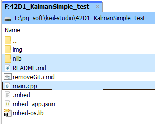

# [42D1_KalmanSimple_test](https://github.com/nBlocksStudioApps/42D1_KalmanSimple_test)

An experimental repository for 42D:

> A schematic Design for Testing the Node [KalmanSimple](https://github.com/nBlocksStudioNodes/nblocks_kalmansimple) and [42D_KalmanSimple_test_SCH](https://github.com/nBlocksStudioApps/42D_KalmanSimple_test_SCH)

With scope to import an existing nBlocksStudio project to the new (December 2021) cloud-based keil-studio, which replaces both mbed-online-compiler and mbed-studio IDE

## The problem
nBlocksStudio repositories contain git controlled sub-directoreis for the libraries. The project tree is created automatically from the nBlocksStudio translator.

nBlocksStudio translator does not create/manage git sub-modules, so when the local repo is pushed to a remote git repo, the remote libraries sub-directories are empty. 
> [to review] Manually managing multiple submodules takes time and is error-prone 

As result when the repo is cloned from github, the library subfolders have no content. 

> [to review ] For importing to keil-studio, even if the submoules were properly managed, the library subfolders can't be imported!!!

## A tested solution

Note the existence of `.git` sub-directory. 
This is what we want to remove from all sub-directories under nLib sub-directory

We first copy the nBlockStudio repo locally to a new one, omitting the huge `mbed-os` sub-directory.  
Then we add the `removeGit.cmd` DOS batch-file to the project-repo-root and we run it.

The .git subdirectories are removed from **all**  sub-directories

The `removeGit.cmd` DOS batch file content is:  
`FOR /d /r . %%d IN (".git") DO @IF EXIST "%%d" rd /s /q "%%d"`

----

### Importing to keil-studio
* Create a new blink keil-studio project: 
  * mbed-os5
  * bare metal
* Remove main and readme.md
* Drag  from the local repo 
  * nLib
  * README.md 
  * main.cpp

* Drop to the created keil-studio project

* Compile and Update `#indlude` path errors, since mbed-studio needed the full path for the `#indlude` files and keil studio needs only the library files without the path.

updated `#indlude` without the path

* Finally, compile without errors 

* and download the compiled binary, to flash the target Microcontroller.

