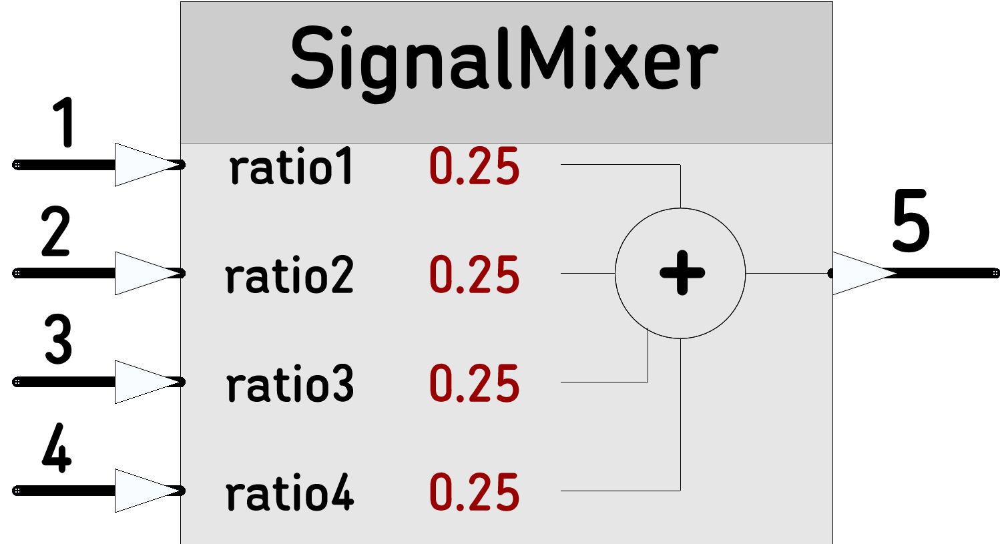

# [SignalMixer](https://github.com/nBlocksStudioNodes/SignalMixer)

Discrete-time Signal Mixer: Adds up to 4 signals. The sampling rate is equal to the frame rate (usually 1ms). The Input values, should be synchronized in a per frame basis 


----

<p align="center">

</p>

----

 *  Category: Math
 *  HAL: No Hardware dependencies
 *  Status:  Node ready to test
 *  Author: Nikolaos Chalikias


## Inputs/Outputs
 *  Float: Input 1,2,3,4 : Triggers Output
 *  float: Output: Mixed output

## Parameters 
*  float: ratio1,2,3,4: value the Input is multiplied with, before added to output


## Example:

```
NoiseSource and ADC: inputs(1),(2) to [SignalMixer], are in sync and will be properly mixed

[Ticker]-->[NoiseSource]-->(1)[SignalMixer]-->[StringFormat]-->[StringSerial]   
        -->[ADC]---------->(2)[SignalMixer]
                        -->(3)[SignalMixer]
                        -->(4)[SignalMixer]

```
